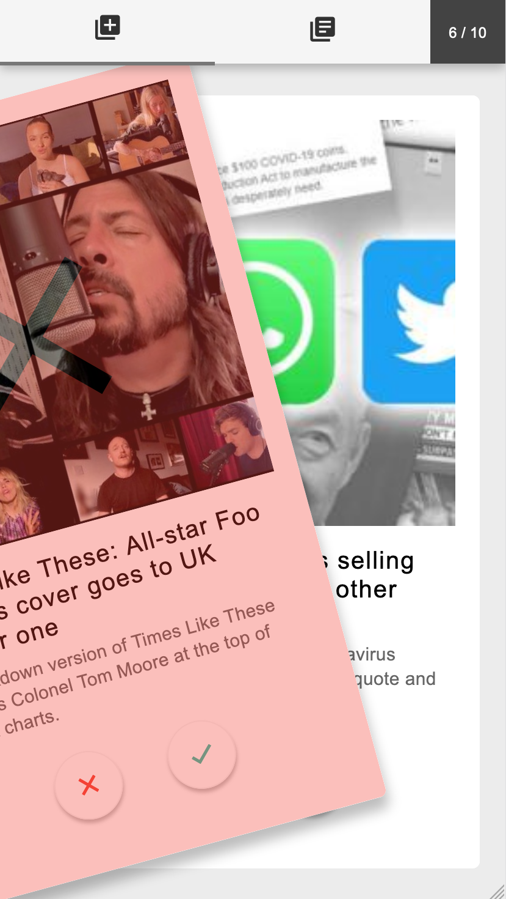
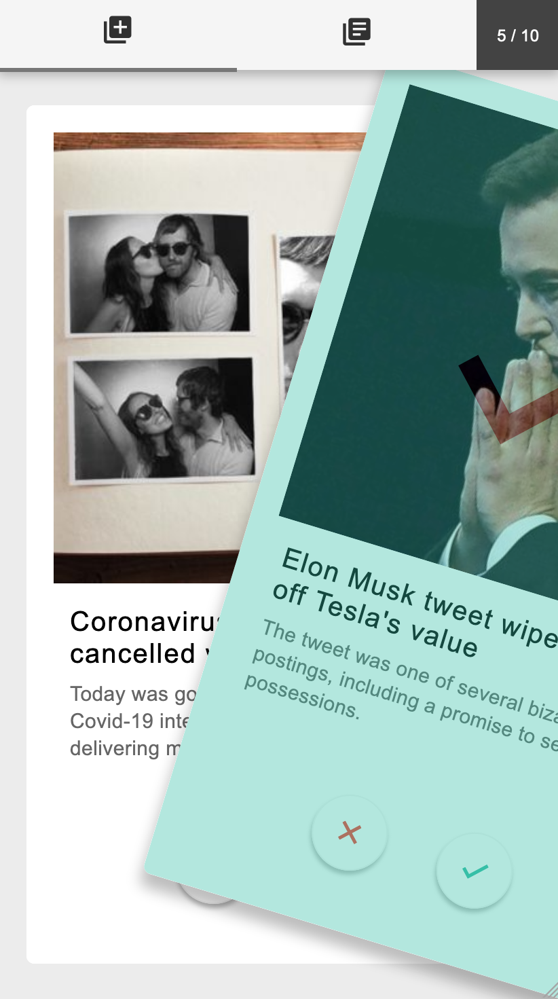

# My News Picks

A novel way for self-curating the news and creating daily personalised reading lists.

Users can quickly swipe through stories to read each day, for instance as part of their morning routine.

The number of selections they can make is limited by a reading target they set, making reading more purposeful.

Their selected stories are then saved for them to read later and the list is reset each morning.

